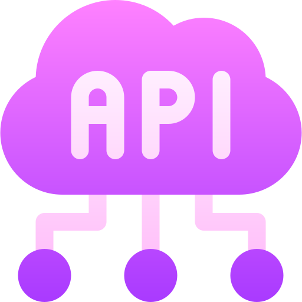
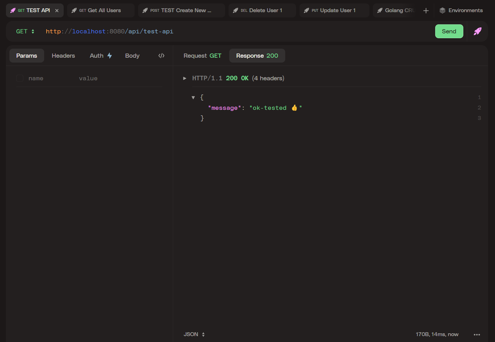
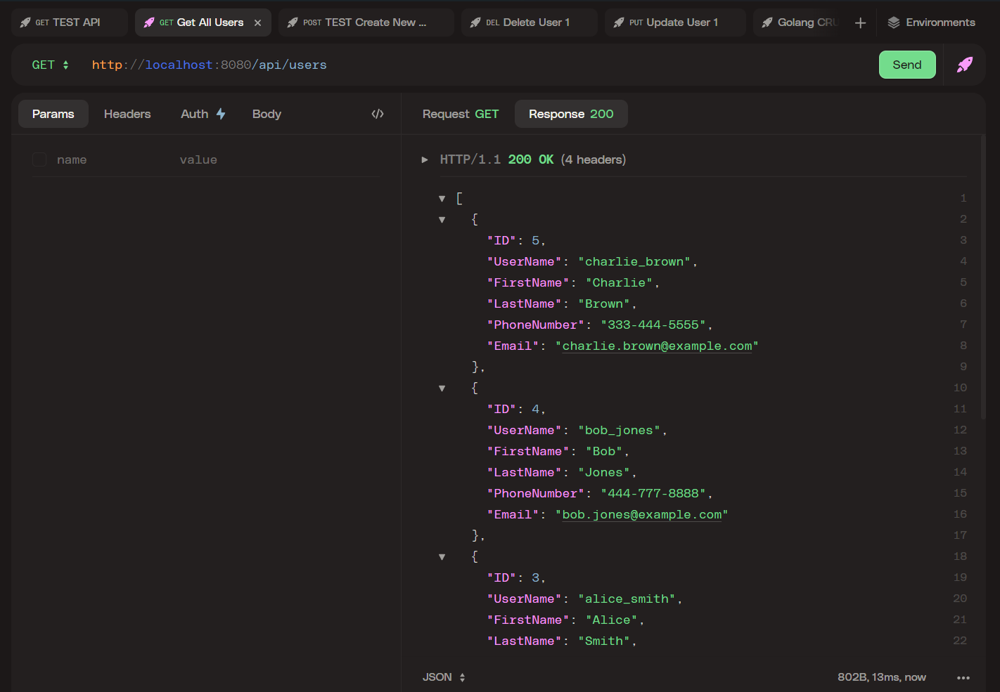
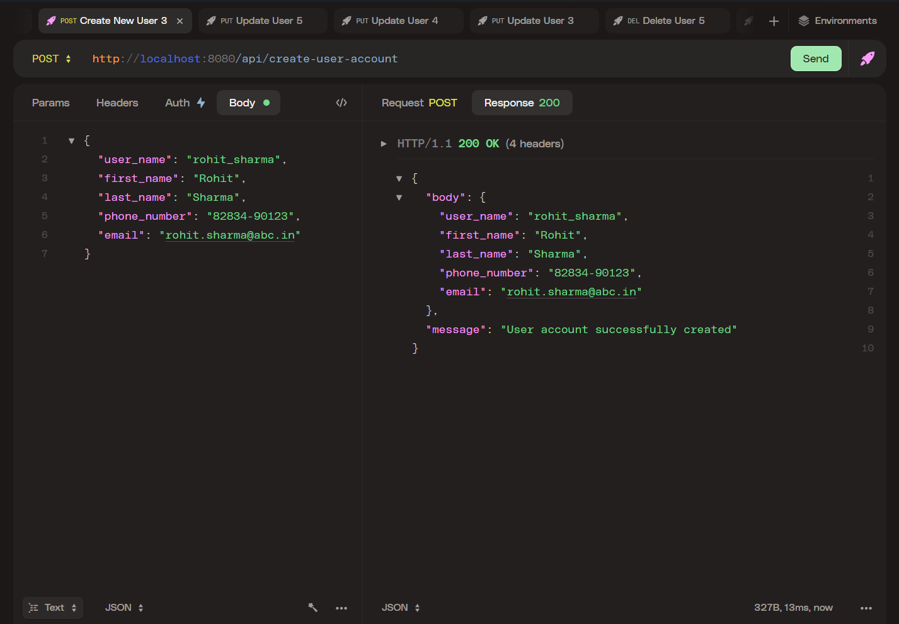
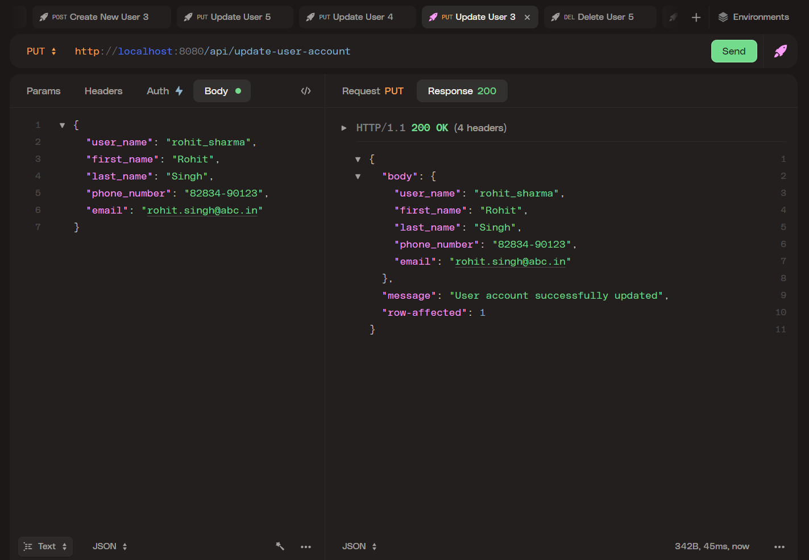
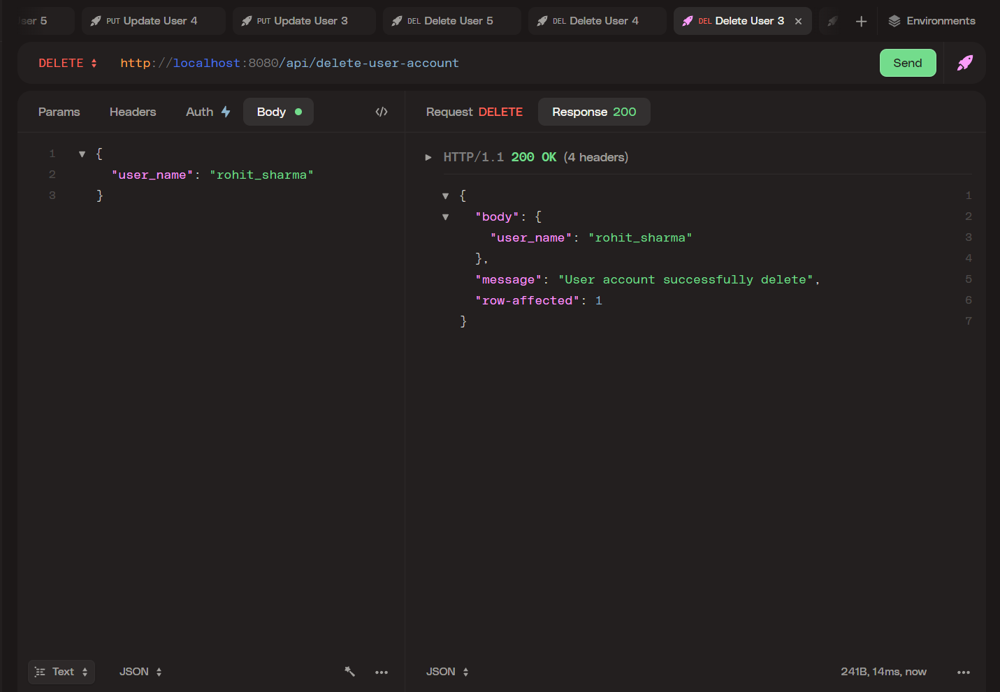

<div align="center">
  
</div>

<h1 align="center">API For User Account Management </h1>

<div align="center">

<br>

</div>

CRUD API for user account management, where users can add, update, delete, and request details about their accounts.

> [!NOTE]
>
> This is only the backend of the CRUD REST API service, as requested in the task

## :computer: Tech Stack
- [**Go**](https://go.dev/) : Programming language
- [**Gin**](https://github.com/gin-gonic/gin) : Web framework
- [**SQLite**]() : Database (embedded in sqlite driver)
- [**SQLite Driver**](https://github.com/mattn/go-sqlite3) : A sqlite3 driver
- [**Goose**](https://github.com/pressly/goose) : A database migration tool

## :star2: Features
- **POST**: Create User Account
- **GET**: Read/Show User Account
- **UPDATE**: Update User Account
- **DELETE**: Delete User Account

> support CRUD operations


## :book: How to Use / Run on Your Machine

- ### Prerequisites:
    - Install Go (version >= 1.23.3): https://golang.org/dl/
    - Install Goose: https://github.com/pressly/goose
    - API Testing Tool
      - Postman
      - Httpie

> I am using [**HttPie**](https://httpie.io/download) for API testing
>
> you can use [Postman](https://www.postman.com/downloads/) too.

- ### Installation:

    - Clone the repository:
    ```sh
    git clone https://github.com/SaketV8/basic-crud-api-golang.git
    ```
    
    - Install dependencies:
    ```sh
    go mod tidy
    ```
    - Generate the Table and default Data:
    ```sh
    goose -dir=databases/migrations sqlite3 app.db up
    ```

    - Run the API:
    ```sh
    go run main.go
    ```
    > :rocket: You're all set! The API server is now running
    >
    > The server is running on PORT 8080 (or a different port depending on your setup).
    > Please check the terminal logs for the exact port

## :books: Additional Info
- DB Table name
```sh
user_accounts
```
- Clear the Database
```sh
goose -dir=databases/migrations sqlite3 app.db down
```
- create the migration for table - user_accounts 
```sh
goose -dir=databases/migrations create user_accounts sql
```
- Check `databases/migrations/`
```sh
# This folder contains the database migration code
```

## :electric_plug: API Endpoints:

- ### Available End Points
    - **GET** `/api/test-api`: Test API
    - **GET** `/api/users`: Fetch all users
    - **GET** `/api/user/:user_name`: Fetch user by user_name
    - **POST** `/api/create-user-account`: Create a new user
    - **PUT** `/api/update-user-account`: Update user information
    - **DELETE** `/api/delete-user-account`: Delete a user

## :hammer_and_wrench: API Example of GET, POST, PUT, DELETE

**GET**
```sh
GET /api/users
```

**POST**
```sh
POST /api/create-user-account

# BODY of request
{
  "user_name": "rohit_sharma",
  "first_name": "Rohit",
  "last_name": "Sharma",
  "phone_number": "82834-90123",
  "email": "rohit.sharma@abc.in"
}
```

**PUT**
```sh
PUT /api/update-user-account

# BODY of request
{
  "user_name": "rohit_sharma",
  "first_name": "Rohit",
  "last_name": "Sharma",
  "phone_number": "82834-90123",
  "email": "rohit.sharma@abc.in"
}
```

**DELETE**
```sh
DELETE /api/delete-user-account

# BODY of request
{
  "user_name": "rohit_sharma"
}
```

## :jigsaw: Usage Examples

<div align="center">
    
</div>

<div align="center">
    
    
</div>

<div align="center">
    
    
</div>


## :seedling: Todo / Future Improvements
- [x] Show All User Account
- [x] Show User Account by UserName
- [x] Add User Account
- [x] Delete User Account
- [x] Update User Account
- [ ] Optimize the code and use best practice (in progress)
- [ ] Code Refactoring
- [ ] Add Auth
- [ ] Usequery param to return only few rows of data


## :compass: About
This project was created as a task for the backend department recruitment process at ABES GeeksforGeeks


<!--  -->


## :label: Attribution

API icon created by Freepik - [Flaticon](https://www.flaticon.com/free-icons/api)

--- 

### License

```
MIT License

Copyright (c) 2024 Saket Maurya

Permission is hereby granted, free of charge, to any person obtaining a copy
of this software and associated documentation files (the "Software"), to deal
in the Software without restriction, including without limitation the rights
to use, copy, modify, merge, publish, distribute, sublicense, and/or sell
copies of the Software, and to permit persons to whom the Software is
furnished to do so, subject to the following conditions:

The above copyright notice and this permission notice shall be included in all
copies or substantial portions of the Software.

THE SOFTWARE IS PROVIDED "AS IS", WITHOUT WARRANTY OF ANY KIND, EXPRESS OR
IMPLIED, INCLUDING BUT NOT LIMITED TO THE WARRANTIES OF MERCHANTABILITY,
FITNESS FOR A PARTICULAR PURPOSE AND NONINFRINGEMENT. IN NO EVENT SHALL THE
AUTHORS OR COPYRIGHT HOLDERS BE LIABLE FOR ANY CLAIM, DAMAGES OR OTHER
LIABILITY, WHETHER IN AN ACTION OF CONTRACT, TORT OR OTHERWISE, ARISING FROM,
OUT OF OR IN CONNECTION WITH THE SOFTWARE OR THE USE OR OTHER DEALINGS IN THE
SOFTWARE.
```